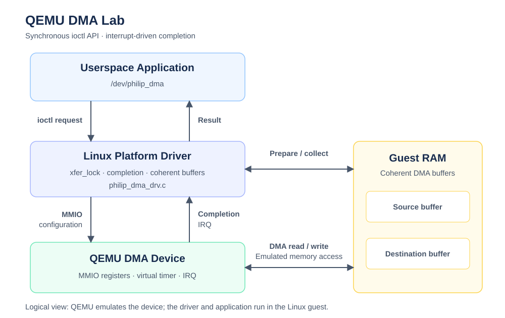

# QEMU DMA Lab

A custom QEMU DMA device and Linux platform driver implementing memory-mapped registers, interrupt-driven completion, coherent DMA buffers, and a userspace ioctl interface.

The project follows the complete device-to-application path: QEMU device modeling, bare-metal validation, ACPI enumeration, Linux driver integration, and userspace benchmarking.

Validation covers normal transfers, invalid requests, timeout recovery, module unloading and reloading, and concurrent requests from two processes using distinct data patterns.

---

# Features

- Custom QEMU SysBus DMA device
- MMIO register interface
- Timer-based asynchronous device completion
- Interrupt-driven DMA transfers
- 32-bit bare-metal device validation
- IOAPIC routing and IDT interrupt handling
- ACPI device enumeration
- Linux platform driver
- Coherent DMA source and destination buffers
- Completion-based waiting
- Mutex protection for shared device resources
- Misc device exposed as `/dev/philip_dma`
- Synchronous userspace ioctl interface
- Invalid request validation
- Timeout recovery with ABORT
- Normal module unload/reload validation
- Latency percentile and throughput reporting
- Two-process data-integrity testing

---

# Project Structure

Selected files in the development workspace:

```text
qemu-dma-lab/
├── README.md
├── .gitignore
│
├── qemu-src/
│   ├── hw/
│   │   ├── i386/
│   │   │   ├── acpi-microvm.c
│   │   │   └── microvm.c
│   │   └── misc/
│   │       ├── meson.build
│   │       └── philip_dma.c
│   └── include/
│       └── hw/
│           └── misc/
│               └── philip_dma.h
│
├── baremetal/
│   ├── Makefile
│   ├── boot.S
│   ├── start.S
│   ├── linker.ld
│   ├── main.c
│   └── dma_test.c
│
├── driver/
│   ├── Makefile
│   └── philip_dma_drv.c
│
├── include/
│   └── philip_dma_uapi.h
│
├── userspace/
│   ├── philip_dma_test.c
│   └── philip_dma_concurrent.c
│
├── tests/
│   ├── philip_dma_negative.c
│   └── philip_dma_verify.c
│
├── linux-guest/
│   ├── init
│   └── initramfs/
│       ├── init
│       ├── bin/
│       │   ├── philip_dma_test
│       │   ├── philip_dma_negative
│       │   └── philip_dma_concurrent
│       └── lib/
│           └── modules/
│               └── philip_dma_drv.ko
│
├── patches/
│   ├── README.md
│   ├── QEMU_BASE_COMMIT
│   └── 0001-philip-dma.patch
│
└── docs/
    └── images/
        └── architecture.svg
```

| Directory | Purpose |
| --- | --- |
| `qemu-src/` | Local QEMU source tree containing the custom DMA device and microvm integration |
| `baremetal/` | 32-bit bare-metal boot code, linker script, MMIO tests, and interrupt validation |
| `driver/` | Linux platform driver and kernel-module Makefile |
| `include/` | Shared ioctl definitions used by the kernel driver and userspace |
| `userspace/` | Userspace transfer benchmark and concurrent correctness test |
| `tests/` | Negative tests and additional data-verification programs |
| `linux-guest/` | Guest init script and initramfs contents |
| `patches/` | Patch that reproduces the custom QEMU changes from QEMU v10.2.4 |
| `docs/images/` | Project architecture diagram |

The `qemu-src/` directory is the local QEMU checkout used during
development. The reproducible QEMU changes are also stored as
`patches/0001-philip-dma.patch`.

The `linux-guest/initramfs/` directory contains generated deployment
files used to build the guest initramfs. Kernel images, compiled
binaries, backup files, and other build artifacts are excluded from
the Git repository.

---

# System Architecture



Userspace applications submit synchronous ioctl requests through `/dev/philip_dma`.

The Linux platform driver prepares coherent DMA buffers and configures the QEMU DMA device through MMIO. The emulated device accesses guest memory and signals completion through an IRQ.

A mutex serializes access to the shared DMA engine, while a completion allows the calling task to sleep until the transfer finishes or times out.

The device operates asynchronously, while the current userspace API waits for completion before returning.

---

# Bare-Metal Validation

Before integrating the Linux driver, the custom DMA device was validated with a 32-bit bare-metal test program running on QEMU microvm.

This stage tested the device directly, without Linux or its driver APIs.

Validation covered:

- MMIO register access
- Source, destination, and transfer-length configuration
- DMA transfer initiation and status polling
- Guest-memory copy verification
- IOAPIC interrupt routing
- IDT entry and interrupt-handler execution
- Completion detection through interrupt counters and test flags

## Memory-Copy Validation

A 16-byte transfer used the following guest physical addresses:

| Parameter | Value |
| --- | --- |
| Source address | `0x110000` |
| Destination address | `0x120000` |
| Transfer length | 16 bytes |

QEMU monitor memory inspection confirmed that the destination contained the expected source data after the transfer.

## Interrupt Validation

The interrupt test used GSI 16, routed to interrupt vector `0x2E`.

QEMU monitor inspection confirmed:

| Variable | Observed Result |
| --- | --- |
| `dma_irq_count` | Changed from 0 to 1 |
| `dma_irq_seen` | Changed from 0 to 1 |
| `dma_test_pass` | Changed from 0 to 1 |
| `dma_test_fail` | Remained 0 |

The QEMU interrupt log recorded:

```text
Servicing hardware INT=0x2e
```

These checks validated the basic MMIO, memory-copy, and interrupt paths before moving to ACPI enumeration, Linux DMA buffers, and completion-based waiting.

The bare-metal interrupt vector is specific to the bare-metal test. Linux manages interrupt routing and vector allocation independently.

---

# Linux Driver Design

## Device Enumeration

The device is described through ACPI and matched by the Linux platform driver.

| Resource | Configuration |
| --- | --- |
| ACPI HID | `PHL0001` |
| MMIO base | `0xFE800000` |
| MMIO region size | `0x1000` bytes |
| Interrupt source | GSI 16 |
| Device node | `/dev/philip_dma` |

Linux maps the ACPI interrupt resource to a Linux IRQ number.

The previously observed Linux IRQ was 49. The driver obtains the IRQ from platform resources rather than assuming that the Linux IRQ equals the GSI.

---

## Register Interface

| Offset | Register | Purpose |
| --- | --- | --- |
| `0x00` | `SRC_ADDR` | Source DMA address, 64-bit |
| `0x08` | `DST_ADDR` | Destination DMA address, 64-bit |
| `0x10` | `LENGTH` | Transfer length |
| `0x14` | `CONTROL` | START and ABORT commands |
| `0x18` | `STATUS` | Engine state |
| `0x1C` | `IRQ_STATUS` | Pending interrupt; write-one-to-clear |
| `0x20` | `IRQ_ENABLE` | Interrupt enable |

The QEMU device uses a virtual-clock timer to model transfer completion.

---

## Userspace Interface

Kernel and userspace share ioctl definitions through:

```text
include/philip_dma_uapi.h
```

The transfer command is:

```c
PHILIP_DMA_IOC_TRANSFER
```

The request contains inline source and destination arrays:

```c
struct philip_dma_ioc_transfer {
    __u32 len;
    __u32 reserved;

    __u8 src[PHILIP_DMA_MAX_LEN];
    __u8 dst[PHILIP_DMA_MAX_LEN];
};
```

The maximum transfer size is 4096 bytes.

Each ioctl uses a private kernel-side request structure. The driver copies source data into a coherent DMA buffer and copies the completed result back into the private request before returning it to userspace.

---

## Synchronization

| Mechanism | Purpose |
| --- | --- |
| `xfer_lock` mutex | Serialize access to the shared DMA engine and buffers |
| Completion | Wait for the IRQ handler to report transfer completion |

The transfer mutex protects:

- Shared source-buffer preparation
- Shared destination-buffer preparation
- Device register programming
- Transfer completion waiting
- Copying the result into the private request

Once the result is stored in the private request, copying it back to userspace does not require holding the shared-engine mutex.

Multiple processes can submit requests concurrently, while the driver processes transfers sequentially through the single DMA engine.

---

## Interrupt Completion

Before starting a transfer, the driver resets its completion state.

The IRQ handler:

1. Reads the device interrupt status.
2. Checks whether the completion interrupt belongs to the device.
3. Acknowledges the interrupt using write-one-to-clear semantics.
4. Calls `complete()` to wake the waiting task.

The transfer path uses `wait_for_completion_timeout()` to bound the completion wait.

---

## Timeout Recovery

Tested recovery scenarios include:

- Delayed DMA completion
- Missing completion interrupts

The recovery path stops the previous operation and prepares the device for subsequent requests.

A timed-out request remains an error even when recovery succeeds.

Both tested scenarios allowed another normal transfer after recovery.

---

# QEMU Source Changes

The custom QEMU changes are distributed as a patch against **QEMU v10.2.4**.

The exact base commit is recorded in:

```text
patches/QEMU_BASE_COMMIT
```

The patch is located at:

```text
patches/0001-philip-dma.patch
```

For a fresh checkout, run from the repository root:

```bash
git clone --branch v10.2.4 --depth 1 \
    https://gitlab.com/qemu-project/qemu.git qemu-src
```

Verify the base commit:

```bash
git -C qemu-src rev-parse HEAD
cat patches/QEMU_BASE_COMMIT
```

The two commit IDs should match.

Check and apply the patch:

```bash
git -C qemu-src apply --check \
    ../patches/0001-philip-dma.patch
```

If the check succeeds:

```bash
git -C qemu-src apply \
    ../patches/0001-philip-dma.patch
```

**Apply the patch only to a clean base checkout. The development checkout already contains these changes and must not have the patch applied again.**

See [patches/README.md](patches/README.md) for additional information.

---

# Build and Run

The following commands cover driver and test deployment in the existing development environment.

Full QEMU build configuration, initial BusyBox filesystem creation, and complete bare-metal and Linux launch commands remain to be documented.

## Build the Linux Driver

Run from the repository root.

When the guest uses the running development-host kernel:

```bash
make -C /lib/modules/"$(uname -r)"/build \
    M="$PWD/driver" modules
```

If the guest uses another kernel release, replace `$(uname -r)` with that release and use its matching headers.

---

## Build the Concurrent Test

```bash
gcc -O2 -Wall -Wextra -std=c11 -static \
    -I./include \
    userspace/philip_dma_concurrent.c \
    -o userspace/philip_dma_concurrent
```

Static linking allows the executable to run in the minimal guest filesystem without additional dynamic libraries.

---

## Install into the Initramfs

These commands assume that the BusyBox initramfs tree has already been prepared.

```bash
cp linux-guest/init \
   linux-guest/initramfs/init

chmod +x linux-guest/initramfs/init

cp driver/philip_dma_drv.ko \
   linux-guest/initramfs/lib/modules/

cp userspace/philip_dma_concurrent \
   linux-guest/initramfs/bin/
```

Package the filesystem:

```bash
(
    set -o pipefail
    cd linux-guest/initramfs || exit 1

    find . -print0 |
        cpio --null -o --format=newc |
        gzip -9 > ../initramfs.cpio.gz
)
```

Boot using the custom QEMU build, a compatible guest kernel, and the generated `linux-guest/initramfs.cpio.gz`.

---

## Run in the Guest

Load the driver:

```sh
insmod /lib/modules/philip_dma_drv.ko
```

Run the concurrent correctness test:

```sh
/bin/philip_dma_concurrent
rc=$?

echo "exit code=$rc"
dmesg | tail -n 40
```

Unload after testing:

```sh
rmmod philip_dma_drv
```

---

# Performance Evaluation

The experiments run in a Linux guest under QEMU TCG, with QEMU itself running inside an Ubuntu VirtualBox VM.

| Component | Configuration |
| --- | --- |
| Outer virtualization | VirtualBox |
| Development environment | Ubuntu |
| Device emulator | Custom QEMU build |
| Guest machine | x86_64 microvm |
| Execution mode | TCG |
| Guest userspace | BusyBox v1.37.0 with a custom initramfs |
| Transfer interface | Synchronous ioctl |
| Maximum transfer size | 4096 bytes |

Measured performance includes driver execution, device emulation, interrupt delivery, and scheduling across the virtualized environment.

These results do not represent physical DMA hardware performance.

Reported metrics include:

- Average latency
- Minimum latency
- P50, P95, and P99
- Maximum latency
- Operations per second
- Throughput in MiB/s

Earlier experiments included logging-on/off comparisons, five repeated runs for 16-, 64-, and 256-byte requests, and a nominal delay sweep from 1 ms to 100 us and 10 us.

Those historical results still need to be matched to exact runtime configurations before publishing a consolidated comparison.

The latest confirmed source setting was:

```c
#define DMA_DELAY_NS 10000ULL
```

This represents a nominal simulated delay of 10 us. Source configuration alone does not establish which rebuilt QEMU executable produced a particular result.

---

# Benchmark Methodology

## Two-Process Transfer Benchmark

Two instances of the existing benchmark are launched in the background.

Configuration:

- Processes: 2
- Transfer size: 4096 bytes
- Iterations per process: 1000
- Interface: synchronous ioctl
- Shared DMA engine protected by `xfer_lock`

Execution:

```sh
/bin/philip_dma_test 4096 > /tmp/dma_A.log 2>&1 &
pid_a=$!

/bin/philip_dma_test 4096 > /tmp/dma_B.log 2>&1 &
pid_b=$!

wait "$pid_a"
rc_a=$?

wait "$pid_b"
rc_b=$?

echo "A exit code=$rc_a"
echo "B exit code=$rc_b"

cat /tmp/dma_A.log
cat /tmp/dma_B.log
```

Reported values describe each process independently.

A common measurement interval was not recorded. The two throughput values are therefore not combined into aggregate device throughput.

---

## Concurrent Data Integrity

The dedicated correctness test uses `fork()` to create two processes. Each independently opens `/dev/philip_dma`.

Before each transfer, the processes exchange ready tokens through `socketpair()`.

Each source pattern includes:

- A process identifier
- An iteration number
- Position-dependent data

After every ioctl, all destination bytes are compared against an independent expected buffer.

Configuration:

- Processes: 2
- Iterations per process: 1000
- Transfer size: 4096 bytes
- Verification: every byte of every transfer
- Synchronization: per-round rendezvous
- Failure reporting: nonzero exit status

This checks for cross-process data contamination and stale results from earlier iterations.

The rendezvous brings both processes to the submission stage before proceeding with each round. It does not guarantee simultaneous driver entry or parallel execution by the DMA engine.

---

# Benchmark Results

## Two-Process Transfer Benchmark

Recorded run: 4096-byte requests, 1000 iterations per process.

| Metric | Process A | Process B |
| --- | ---: | ---: |
| Average | 642.305 us | 735.539 us |
| Minimum | 77.051 us | 148.794 us |
| P50 | **521.272 us** | **593.104 us** |
| P95 | 1427.140 us | 1575.929 us |
| P99 | **2165.106 us** | **2380.764 us** |
| Maximum | 23504.497 us | 26662.786 us |
| Operations/s | 1556.89 | 1359.55 |
| Throughput | 6.082 MiB/s | 5.311 MiB/s |
| Exit code | 0 | 0 |

Both processes completed successfully.

The supplied kernel log contained no related DMA timeout, Oops, or BUG report.

Median latency was approximately **0.52–0.59 ms**, while P99 reached approximately **2.17–2.38 ms**.

Maximum values reached approximately **23.5–26.7 ms**, showing a substantial latency tail in this run.

This basic run did not establish distinct source patterns or record exact execution overlap. Data isolation was checked separately with the dedicated correctness test.

---

## Concurrent Data Integrity

| Metric | Process A | Process B |
| --- | ---: | ---: |
| PID | 72 | 73 |
| Transfer size | 4096 bytes | 4096 bytes |
| Verified transfers | 1000 / 1000 | 1000 / 1000 |
| Data mismatches | 0 | 0 |
| Elapsed time | 0.831 s | 0.835 s |

Recorded output:

```text
[A] ready: PID=72, len=4096, rounds=1000
[B] ready: PID=73, len=4096, rounds=1000
[A] PASS: 1000/1000 transfers verified, 4096 bytes each, elapsed=0.831 s
[B] PASS: 1000/1000 transfers verified, 4096 bytes each, elapsed=0.835 s
OVERALL PASS: two processes, 2000 transfers, distinct patterns, zero mismatches
exit code=0
```

**All 2000 transfers passed byte-by-byte verification.**

Elapsed time includes pattern preparation, synchronization, ioctl execution, and verification. It is not a measurement of pure DMA execution time.

---

# Functional Validation

| Test | Observed Result | Status |
| --- | --- | --- |
| Bare-metal memory copy | Expected data observed in destination memory | PASS |
| Bare-metal interrupt | IRQ counter and completion flags updated | PASS |
| Zero-length request | `EINVAL`; subsequent normal transfer succeeds | PASS |
| Oversized request: 4097 bytes | `EINVAL`; subsequent normal transfer succeeds | PASS |
| Unsupported ioctl | `ENOTTY`; subsequent normal transfer succeeds | PASS |
| NULL request pointer | `EFAULT`; subsequent normal transfer succeeds | PASS |
| Delayed DMA completion | Timeout, ABORT recovery, then successful normal transfer | PASS |
| Missing completion IRQ | Timeout cleanup, then successful normal transfer | PASS |
| Normal module unload | ABORT, idle engine, and IRQ handler release confirmed | PASS |
| Device node after unload | `/dev/philip_dma` disappears | PASS |
| Reload | Normal transfer succeeds | PASS |
| Unload with an open descriptor | Rejected; exit code 1 | PASS |
| Unload after closing the descriptor | Successful; exit code 0 | PASS |
| Concurrent distinct-pattern transfers | 2000 transfers; zero mismatches | PASS |

Confirmed unload messages:

```text
ABORT processed, timer cancelled, state cleared
remove: engine idle, IRQ handler released
driver removed
```

Normal module unload protection does not establish safety for sysfs unbind with an open descriptor, hot removal, or device removal during an active transfer.

Those scenarios are outside the completed validation scope.

---

# Discussion

## Bare-Metal and Linux Validation

Bare-metal testing validated the basic device behavior without relying on Linux enumeration, DMA allocation, or completion APIs.

Linux integration added platform resource discovery, coherent DMA allocation, process-context waiting, and a userspace interface.

Testing both environments helped separate device-model and interrupt-routing issues from Linux driver integration issues.

---

## Userspace-Visible Latency

Transfer latency can include request copying, mutex waiting, coherent-buffer preparation, MMIO access, emulated device delay, interrupt processing, scheduling, and result copying.

The exact timing boundaries should be checked against the benchmark source before comparing its output with another implementation.

A configured device delay is not the same as observed ioctl latency.

---

## Tail Latency

Both processes showed a large gap between median and maximum latency.

Host activity, VirtualBox scheduling, QEMU execution, and guest scheduling are possible contributors. The current measurements do not isolate their individual effects.

These results describe this particular run and do not establish a general latency guarantee.

---

## Shared Resource Synchronization

The two-process correctness test supports the effectiveness of the current mutex-protected transfer path under the tested workload.

No cross-process or stale-pattern corruption was observed.

Concurrent request submission is supported through serialization of a single DMA engine. The test does not demonstrate parallel hardware transfers or prove the absence of every possible race.

---

# Current Status

Implemented and validated:

- QEMU DMA device and MMIO register interface
- Bare-metal DMA and interrupt validation
- ACPI enumeration and Linux driver integration
- Userspace ioctl transfers
- Latency percentile and throughput reporting
- Invalid request handling
- Timeout recovery for delayed completion and missing IRQ
- Normal module unload/reload
- Open-descriptor module unload protection
- Two-process correctness testing with distinct patterns

Documentation follow-up:

- Archive original benchmark and validation logs.
- Record matching source commits and binary identities.
- Record the exact guest configuration.
- Consolidate historical logging comparisons and delay-sweep results.
- Document full QEMU build and guest filesystem setup.
- Document the complete bare-metal and Linux launch commands.

Only results with confirmed configuration mappings should be used for comparative performance claims.

---

# Future Work

Potential extensions include:

- More processes and mixed transfer-size stress tests
- sysfs unbind and outstanding-descriptor lifetime handling
- Transfer/removal concurrency testing
- CPU affinity and scheduling experiments
- Native Linux or KVM comparison where available
- Kernel and QEMU tracing to separate latency contributions
- Asynchronous userspace submission and completion notification
- CSV result export and automated benchmark visualization
